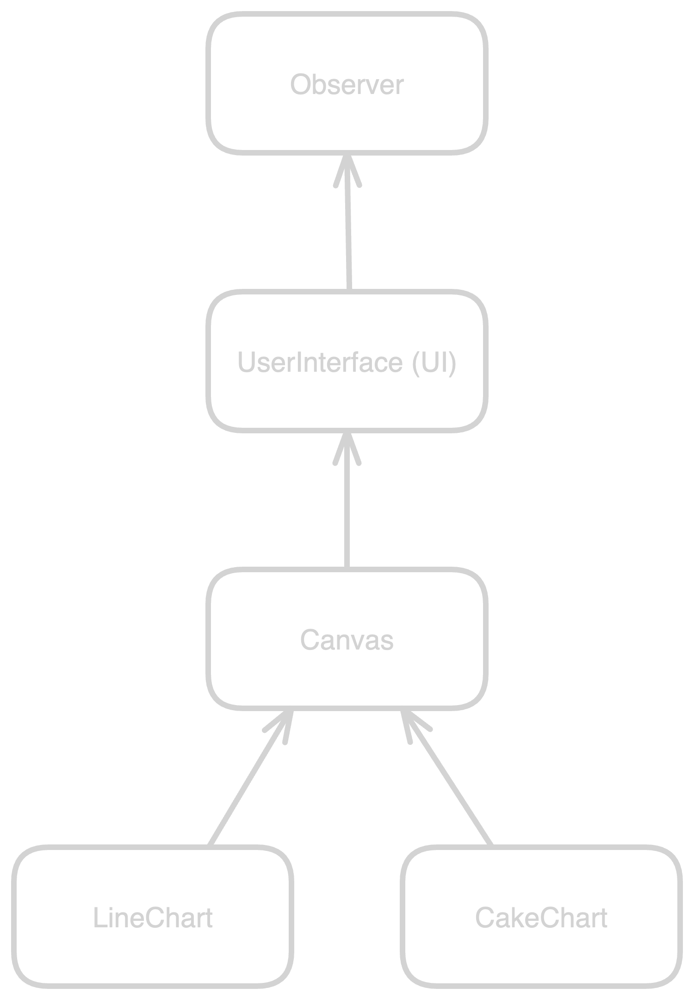
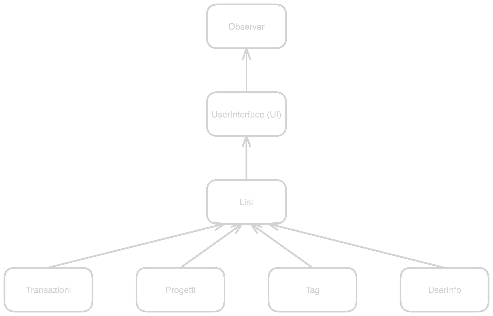
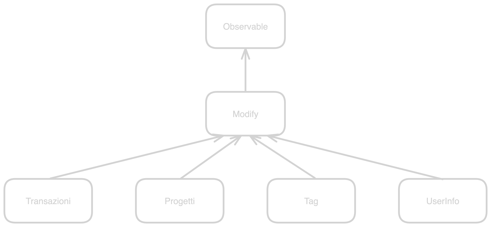
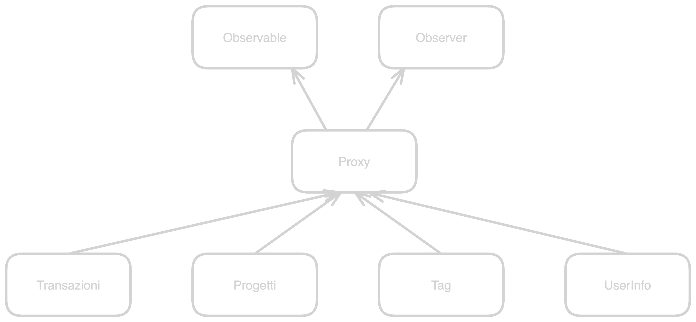

# Stand-up (?)

- brainstorming
- backlog
- issues

# Brainstorming

- abbiamo provato a consegnare il progetto
- non ce l'abbiamo fatta
- abbiamo un PoC

## Front-end

- bisogna riscrivere il codice da capo
- ho capito di cosa abbiamo bisogno

## CSS

- come siamo messi?
- c'è qualcosa da fare? che cosa?

## Back-end

- il database va bene
- bisogna riscrivere il codice da capo
- bisogna creare una libreria interna

# Backlog

- ho progettato un po' di cose
- principalmente front-end e backend

## Front-end

- bisogna ristrutturare il codice
- bisogna adottare una gerarchia e dei pattern
- per rendere il codice più comprensibile e manutenibile

### Canvas

\import[[canvas.md]]

### List

\import[[list.md]]

### Modify

\import[[modify.md]]

### Proxy

\import[[proxy.md]]
